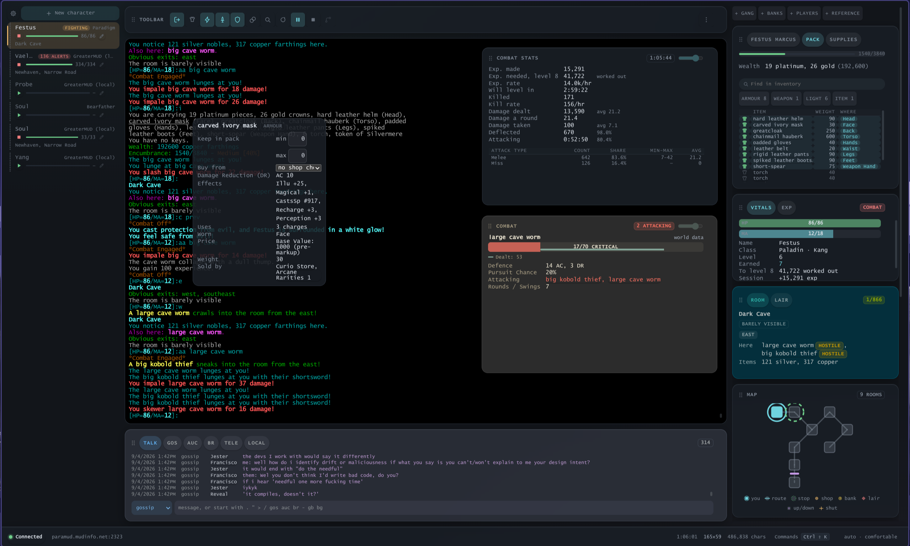

# mudengine

**A modern way to play a classic game.**



## What is this?

Back in the days before the web, people dialled into bulletin board systems and
played a game called **MajorMUD** — a shared world made entirely of text, where
thousands of players explored, fought monsters, formed gangs and built
characters over months and years. Against all odds, that world is still alive.
Communities run servers to this day, and people still play.

**mudengine is a fresh start.** It is a brand-new program for playing MajorMUD
and the games descended from it, built for today's computers — Windows, Mac and
Linux — with everything the old tools did and a great deal they never could.

## What it does

**It shows you the game clearly.** The game itself sits in the middle of the
window, exactly as it always looked. Around it, the client keeps a live
scoreboard: your health, your experience, what you are carrying, who is in the
room with you, a map of where you are, and the conversations happening around
the realm — all updated as you play, without you asking.

**It plays alongside you.** The repetitive parts of the game — fighting the
same monsters, sitting down to recover, picking up the treasure, walking the
same long roads — can be handed to the client. It fights when you want it to,
rests when you are hurt, gathers what the monsters drop, and walks routes you
choose. You stay in charge: the moment you touch the keyboard, you have the
wheel.

**It is honest about what it is doing.** Every helper in mudengine explains
itself. If it attacked, it says why. If it *refused* to attack, it says why.
If it is not sure where you are, it stops and says so rather than guessing —
because a wrong guess is how a character dies at an unattended keyboard.

**It handles a whole stable of characters.** Each character gets its own tab,
up to four can be on screen side by side, and any of them can live in a window
of its own. The characters you are *not* watching still watch themselves: if
one drops to low health or gets into trouble, its tab lights up and tells you.

**It knows the world.** Built into the client is a map of more than fifty
thousand rooms. Click a place on the map and it shows you the way there —
and walks it, one careful step at a time, checking after each step that it
actually arrived where it expected.

## What it aims to be

The goal is simple to say: **everything MegaMUD was, on any computer made this
century, without the guesswork.** A player from 1998 should feel at home; a
player from today should never feel like they are operating a museum piece.

The deeper goal is trust. Automation in this game has always meant crossing
your fingers — scripts that ran blind and characters that died to a mystery.
mudengine is built on the opposite idea: it never pretends to know something
it doesn't, it never quietly does something you can't inspect, and when it
declines to act, it tells you that too.

## Running it in a container

There is an image, and it is the client served over HTTP: main runs as a Node
server, the window is served to your browser, and the game sockets, the files
and the automation stay in the container.

```
docker run --rm -p 8080:8080 -v mudengine:/config rayzorben/mudengine:latest
```

Then open `http://localhost:8080/` and sign in with the password the
container printed on its first start.

**What is actually running.** The same client as the desktop one, under a
different host: `src/main/host/WebHost.ts` carries the typed IPC contract over
one WebSocket per browser tab instead of Electron's IPC, and everything else in
main is untouched. Nothing is drawn in the container. (An earlier image ran the
desktop client on a virtual display behind noVNC; it was 1.5GB of Xvfb, a
window manager and Electron's GTK stack, and it is gone.)

| | |
|---|---|
| `-p 8080:8080` | the port the browser connects to. |
| `-v mudengine:/config` | **keep this.** It is `MUDENGINE_HOME`: your options file, realms, characters, logs and the access password. Without it they are deleted with the container. |
| `-e MUDENGINE_PASSWORD=…` | choose the password instead of having one generated. |

**The password.** On the first start the container generates one, prints it
once, and saves it to `/config/.access-password` on the volume. Later starts
do not reprint it. Delete that file to have a new one made, or set
`MUDENGINE_PASSWORD` to choose your own. Signing in sets a session cookie for
the browser; the socket that carries the game and the settings screen is
refused on the upgrade without one, and refused from any other origin.

**Read this before exposing the port.** The connection is **not encrypted**:
the password travels as a form field and the session as a cookie. On anything
other than a machine you are sitting at, put a TLS-terminating proxy in front
of it, and set `MUDENGINE_TRUST_PROXY=1` so the client believes the proxy's
`X-Forwarded-Proto` — without it the client assumes cleartext whatever a
header says, because a header is something anybody can send. Outside a
container the client binds to `127.0.0.1` unless `MUDENGINE_BIND` says
otherwise; the image binds to every address because the published port is
the only way in.

**One client per home.** The client takes `.lock` under its home on start and
refuses to start beside another client on the same files, naming the pid
that holds it — two clients on one home write the same records and dial the
same characters. A lock left by a client that died is taken over and said so.

**What a browser tab cannot do.** Moving a character to a second window is a
desktop feature and the tab does not offer it. *Show the options file* and its
siblings list the directory in the window instead of opening a file manager
on a machine you are not at, and choosing a realm database browses the
container's `/config` — copy a database there first. Copy and paste use the
browser's own clipboard.

**Bind mounts.** The image runs as uid 1000. A bind-mounted directory owned by
anybody else is a container that cannot write its options file; the named
volume above is the form that needs no arrangement.

Building it yourself is `npm run docker:build`, which reads the tag out of
`package.json` so it cannot drift from the release it belongs to.
`npm run docker:run` runs what that built. Pushing is a separate command on
purpose. The same server runs outside a container with `npm run build && npm
run web`.

## Where it stands

Everything described above works today. The project is not yet at version 1.0 —
polish, deeper automation and packaged installers for every platform are still
being finished — but it is played on daily, against real servers, with real
characters.